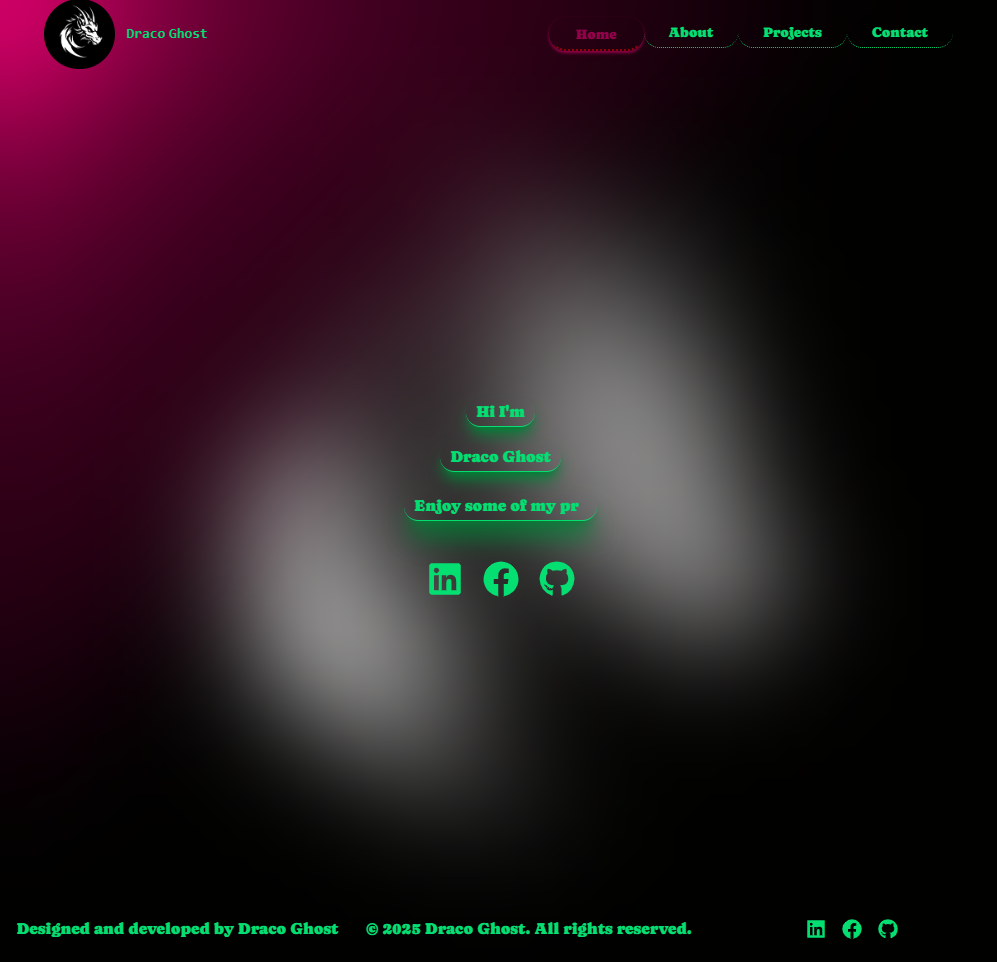

# Draco Ghost's Developer portfolio

Welcome to my personal portfolio website - a showcase of my work, skills, and passions as a developer and a creator.

🔗 [Live Site](https://draco-ghost.github.io/portfolio)

---



---

## 🛠️ Tech Stack

This project is built with:

- **React + Vite**
- **Tailwind CSS** for fast and responsive styling
- **React Router** for client-side routing
- **Icons:** react-icons (Font Awesome, etc.)

---

## 🚀 Getting Started

To run the project locally:

```bash
git clone https://github.com/draco-ghost/portfolio.git
cd portfolio
npm install
npm run dev 
```

---

## 🚀 Deployment

This site is deployed using Github Pages via the [gh-pages](https://www.npmjs.com/package/gh-pages) package.

---

## 📝 License
This project is licensed under the [GNU General Public License v3.0](./LICENSE)
Please credit this repository if you use or modify any of the source code
